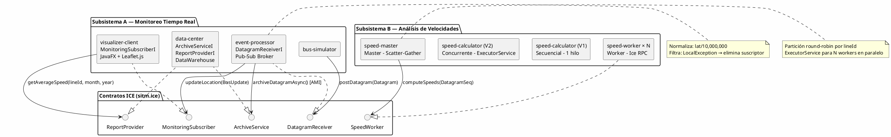

# Plan de Arquitectura: Sistema de Monitoreo y Análisis SITM-MIO
## Vista Completa — 8 Módulos, 2 Subsistemas

---

## 1. Diagrama de Componentes (Vista Lógica)



---

## 2. Responsabilidades de los 8 Módulos

### `contracts` — Contratos Slice
- **Rol:** Módulo de definición de interfaces; no tiene lógica de negocio.
- **Artefacto:** `sitm.ice` → generado por Ice-Builder a código Java.
- **Interfaces:** `DatagramReceiver`, `ArchiveService`, `MonitoringSubscriber`, `ReportProvider`, `SpeedWorker`
- **Structs:** `Datagram`, `BusUpdate`, `Location`, `SpeedReport`, secuencias `BusUpdateSeq`, `DatagramSeq`, `SpeedReportSeq`

### `bus-simulator` — Productor de Eventos
- **Rol:** Cliente Ice que simula la flota de buses leyendo un CSV.
- **Patrón:** Cliente Ice (proxy `DatagramReceiverPrx`).
- **Comportamiento:** Lee cada línea del CSV, construye un `Datagram`, llama `postDatagram()` y espera 500 ms. Incluye `PathResolver` para buscar el CSV en rutas relativas o `/opt/sitm-mio/`.

### `event-processor` — Broker Pub-Sub Central
- **Rol:** Servidor Ice en `:10000`. Nodo central de procesamiento y distribución.
- **Patrón:** **Observer / Pub-Sub** con **AMI** para el archivado.
- **Responsabilidades:**
  1. Recibe `postDatagram(Datagram)` del simulador
  2. Normaliza coordenadas: `lat / 10,000,000.0` → grados decimales
  3. Archiva en Data Center de forma **asíncrona** (`archiveDatagramAsync`) para no bloquear el flujo
  4. Notifica a suscriptores registrados con `updateLocation(BusUpdate)`
  5. Gestión de fallos: elimina suscriptores que lancen `LocalException`

### `data-center` — Almacén y Proveedor de Reportes
- **Rol:** Servidor Ice en `:10001`. Persiste datagramas y calcula velocidades históricas.
- **Patrón:** **Repository** (`DataWarehouse`) + **Servant Ice** (`ArchiveServiceI`, `ReportProviderI`)
- **Algoritmo de velocidad:** Para cada `(lineId, month, year)`: agrupa por `tripId`, ordena por `datagramDate`, calcula `Σ(Δodómetro) / Σ(Δsegundos) × 3.6`, filtra `kmh > 120`.

### `visualizer-client` — Interfaz Gráfica de Monitoreo
- **Rol:** Aplicación JavaFX. Suscriptor Ice con endpoint dinámico.
- **Patrón:** **Subscriber (Callback Ice)** + **MVC** (Model: markers{}, View: Leaflet.js, Controller: MonitoringSubscriberI)
- **Flujo:**
  1. `Launcher` inicia JavaFX con `WebView` cargando `map.html` (Leaflet.js + OpenStreetMap)
  2. `initIce()` conecta con event-processor y llama `subscribe(MonitoringSubscriberPrx)`
  3. Cada `updateLocation(BusUpdate)` despacha a JavaFX UI thread vía `Platform.runLater()`
  4. Ejecuta `updateBus(busId, lat, lng, lineId, time)` en `map.html` para mover el marcador

### `speed-calculator` — Análisis V1 y V2
- **Rol:** Ejecutable standalone (no necesita red ni Ice en ejecución).
- **Patrón V1:** Secuencial puro.
- **Patrón V2:** **Fork-Join / Thread Pool** con `ExecutorService.newFixedThreadPool(availableProcessors())`. Una tarea por `lineId`.

### `speed-worker` — Nodo Worker V3
- **Rol:** Servidor Ice en puerto configurable (default `:10100`).
- **Patrón:** **Worker (Servant Ice)** en el patrón Master-Worker.
- **Implementa:** `SpeedWorkerI.computeSpeeds(DatagramSeq)` — misma lógica que `SpeedEngine`.

### `speed-master` — Coordinador V3
- **Rol:** Cliente Ice que coordina la distribución y recolección.
- **Patrón:** **Master (Scatter-Gather)**.
- **Flujo:** Lee workers desde `speed-master.cfg` → lee CSV → particiona por `lineId` en round-robin → envía particiones con `ExecutorService` en paralelo → agrega `SpeedReport[]` de todos los workers.

---

## 3. Flujo de Datos — Subsistema de Monitoreo

```
Tiempo real (cada 500 ms en simulación):

bus-simulator ──[Ice RPC TCP :10000]──► event-processor
                                              │
                               ┌──────────────┼──────────────────┐
                               │ (async AMI)  │ (sync notify)    │
                               ▼              ▼                  │
                          data-center    MonitoringSubscriberI   │
                         (DataWarehouse)   (visualizer-client)   │
                                                │                 │
                                    Platform.runLater()           │
                                                │                 │
                                     JavaFX executeScript()       │
                                                │                 │
                                       updateBus() en Leaflet.js ─┘

Consulta histórica (bajo demanda):

visualizer-client ──[Ice RPC TCP :10001]──► data-center
                                              (ReportProviderI)
                                              (DataWarehouse.getAverageSpeed)
```

---

## 4. Flujo de Datos — Subsistema de Velocidades V3

```
speed-master arranca:
  1. Lee speed-master.cfg: Worker.Count=2, Worker.0=:10100, Worker.1=:10101
  2. checkedCast a cada worker → descarta no disponibles
  3. Lee CSV y agrupa datagramas por lineId
  4. Round-robin: Worker[0] ← {lineId=131, 140, ...}, Worker[1] ← {lineId=147, ...}
  5. ExecutorService: envía en paralelo computeSpeeds(particion[i]) a Worker[i]
  6. Future.get() recolecta SpeedReport[] de cada worker
  7. Agrega + ordena + imprime tabla final
```

---

## 5. Decisiones Arquitectónicas Clave

| Decisión | Alternativa Rechazada | Razón |
|---|---|---|
| ZeroC Ice para RPC | REST/HTTP | Ice provee tipado estático, serialización binaria eficiente y soporte nativo para callbacks (AMI, Pub-Sub) |
| AMI para archivado | Llamada síncrona al Data Center | La llamada síncrona bloquea el hilo del event-processor ~5-10ms por datagrama; AMI mantiene el throughput de ingesta |
| Pub-Sub con endpoint dinámico | Polling del visualizador | El polling requeriría una API de consulta continua en el event-processor y agregaría latencia de sondeo |
| CSS `100vw/100vh` + polling en Leaflet | JS `window.innerWidth/Height` | JavaFX WebView reporta dimensiones 0×0 en el primer ciclo de layout; el polling espera a tener dimensiones reales |
| Configuración en `.cfg` | Hardcoded en código | Permite cambiar topología de workers sin recompilar (driver de Modificabilidad) |
| `checkedCast` antes de distribuir | `uncheckedCast` | `checkedCast` verifica que el worker esté activo antes de intentar distribuir; evita `ConnectionRefusedException` tardía |
